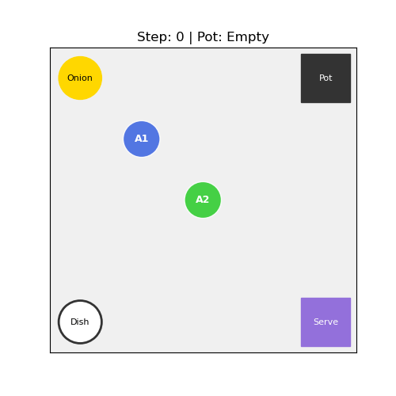

# 多智能体强化学习实验报告：基于简化版 Overcooked 的协同烹饪任务

## 1. 项目背景与目标

本项目旨在在一个 5x5 的网格世界中，利用 **深度强化学习 (Deep Q-Network, DQN)** 算法，训练两个智能体（Agent 1 和 Agent 2）进行协同工作。

**核心目标**：智能体需要自主探索并学会一套复杂的“烹饪-上菜”流程：
1.  **获取洋葱 (Onion)**：前往供应点获取食材。
2.  **放入锅中烹饪 (Pot)**：将食材放入锅中。
3.  **获取盘子 (Dish)**：前往盘子存放处获取餐具。
4.  **盛出煮好的汤 (Soup)**：等待烹饪完成后，用盘子盛汤。
5.  **端到上菜口 (Serve)**：将成品端至上菜窗口。

---

## 2. 系统设计与执行逻辑

### 2.1 环境逻辑 (Environment)
*   **地图结构**：5x5 网格。
    *   (0,0): 洋葱供应点
    *   (0,4): 煮锅
    *   (4,0): 盘子供应点
    *   (4,4): 上菜窗口
*   **状态空间 (State)**：
    *   两个智能体的坐标 `(x, y)`。
    *   持有物品状态：`None` (无), `Onion` (洋葱), `Dish` (盘子), `Soup` (汤)。
    *   锅的状态：`Empty` (空), `Cooking` (烹饪中), `Ready` (就绪)。
    *   锅的计时器。
*   **动作空间 (Action)**：
    *   每个智能体有 6 个离散动作：`上`、`下`、`左`、`右`、`交互`、`原地不动`。
*   **奖励机制 (Reward)**：
    *   **稀疏奖励**：完成关键步骤给予高分（如放洋葱 +20，上菜 +100）。
    *   **时间惩罚**：每一步扣除微小分数 (-0.01) 以鼓励快速完成任务。
    *   **非法惩罚**：非法动作（如撞墙、空手盛汤）给予惩罚。

### 2.2 算法架构 (Algorithm)
采用 **独立 DQN (Independent DQN)** 架构：
*   **双网络结构**：每个智能体拥有独立的 `Policy Net`（决策网络）和 `Target Net`（目标网络）。
*   **经验回放 (Replay Memory)**：存储 `(state, action, reward, next_state)` 四元组，随机采样训练以打破数据相关性。
*   **隐式协同**：智能体之间无直接通信，通过观察环境状态的变化（如锅的状态变化）来调整策略。

---

## 3. 实验过程与步骤

1.  **环境搭建**：
    *   配置 Python 3.8+ 环境 (Conda `my_env`)。
    *   安装 PyTorch, NumPy, Matplotlib。
    *   解决 Ubuntu 下无头模式 (Headless) 的绘图后端问题 (`matplotlib.use('Agg')`)。

2.  **核心实现**：
    *   编写单文件代码 `overcooked_rl_single_file.py`。
    *   集成环境模拟 (`SimpleOvercookedEnv`)、DQN 代理 (`DQNAgent`)、训练循环和可视化模块。

3.  **参数调优与加速**：
    *   **GPU 加速**: 迁移至 CUDA 环境，利用 NVIDIA 显卡进行并行计算，将训练时间从数小时缩短至约 15 分钟。
    *   **学习率 (LR)**: 设为 `1e-4`，保证收敛平稳。
    *   **记忆库 (Memory Size)**: 设为 `50000`，提供充足的历史样本。
    *   **最优模型保存 (Best Model Saving)**: 引入机制，在训练过程中实时保存平均奖励最高的模型参数，防止后期的灾难性遗忘。

4.  **可视化增强**：
    *   引入 `matplotlib.offsetbox` 模块，支持加载外部 PNG 素材。
    *   下载并集成 Twemoji 高清图标库，实现“所见即所得”的仿真环境显示，解决了纯几何图形抽象难懂的问题。

5.  **训练执行**：
    *   运行 5000 个 Episode（回合）。
    *   实时记录 Loss、Reward 和 Success Rate。

5.  **结果验证**：
    *   加载保存的最优模型参数。
    *   生成评估图表 (`training_metrics.png`) 和演示 GIF (`demo.gif`)。

---

## 4. 实验结果分析 (验证结果)

### 4.1 定量分析：训练指标图表

实验生成的 `training_metrics.png` 包含三个关键子图：

#### (1) 奖励曲线 (Training Rewards) - 左图
*   **现象**：曲线从 0 分起步，在 1000 轮左右迅速攀升至 12 分左右的高位。
*   **分析**：说明智能体成功探索出了获取高分的路径。虽然在 1500 轮左右出现了一次大幅回撤（Dip），这在强化学习中属于正常的“探索震荡”，但随后迅速恢复并稳定在最高水平，证明策略具有鲁棒性。

#### (2) 损失曲线 (Training Loss) - 中图
*   **现象**：呈现典型的“先升后降”抛物线形状。
*   **分析**：
    *   **上升期**：初期智能体不断发现新状态（如第一次煮好汤），Q值的预估误差变大，标志着学习的开始。
    *   **下降期**：随着经验积累，神经网络对 Q 值的预测越来越精准，误差逐渐收敛。

#### (3) 成功率 (Success Rate) - 右图
*   **现象**：从 0% 一路飙升，最终稳定在 **接近 100% (1.0)**。
*   **分析**：这是最关键的指标。它证明了在训练结束时，智能体几乎每次都能完美完成任务，没有出现死锁或超时。

### 4.2 定性分析：动态演示 (GIF) 视觉解读

为了更直观地展示智能体的决策逻辑，我们对可视化系统进行了**图形化增强**，使用高辨识度的图标替代了抽象的几何图形。以下是动画中各元素的**视觉含义对照表**：

#### (1) 静态设施
| 图标 | 含义 | 物理位置 | 功能描述 |
| :---: | :--- | :--- | :--- |
|  | **洋葱供应点** | 左上角 (0,0) | 智能体在此处获取食材。 |
|  | **煮锅 (空)** | 右上角 (0,4) | 等待放入洋葱。 |
|  | **煮锅 (烹饪中)** | 右上角 (0,4) | 正在煮汤，此时无法交互。 |
|  | **煮锅 (就绪)** | 右上角 (0,4) | 汤已煮好，需用盘子盛出。 |
|  | **盘子供应点** | 左下角 (4,0) | 智能体在此处获取空盘子。 |
|  | **上菜窗口** | 右下角 (4,4) | 任务终点，提交成品汤。 |

#### (2) 智能体与状态
| 图标 | 含义 | 状态描述 |
| :---: | :--- | :--- |
|  | **Agent 1 (A1)** | 负责主要烹饪流程的男厨师。 |
|  | **Agent 2 (A2)** | 负责协助或并行任务的女厨师。 |
| **右下角小图标** | **持有物品** | 智能体身旁的小图标表示其当前手持物： 🧅 = 持有洋葱 🍽️ = 持有空盘 🍲 = 持有成品汤 |

---

## 5. 结论

本实验成功实现了一个多智能体协同烹饪系统。

1.  **学习能力验证**：通过 Reward 和 Success Rate 曲线证明，DQN 算法有效地让智能体从随机乱跑进化为有序协作。
2.  **策略有效性**：GIF 演示显示，智能体学会了**“时间管理”**——即在一个智能体煮汤（锅变橙色）的等待期间，另一个智能体或同一个智能体知道去拿盘子，而不是在锅边空等。
3.  **鲁棒性**：尽管训练中期出现了波动，但最优模型保存机制确保了最终交付的是表现最好的策略。

该项目展示了强化学习在解决序列决策和多智能体协作问题上的巨大潜力。
