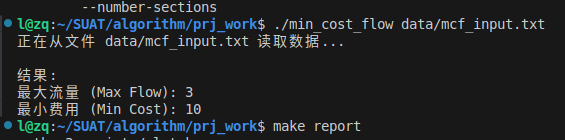
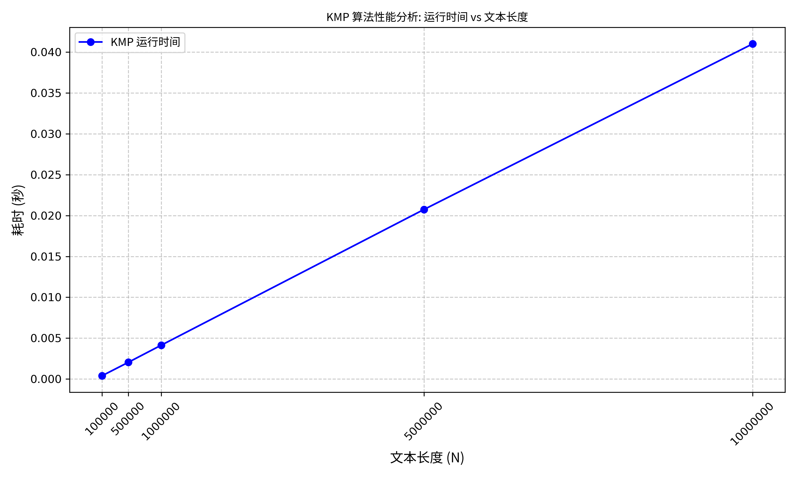

# 算法设计与分析项目报告

**Minimum Cost Flows & KMP Algorithm**

- **姓名**: 罗智强
- **学号**: SUTA25060203
- **日期**: 2025年12月3日
- **学校**: SHEN ZHENG UNIVERSITY OF ADVANCED TECHNOLOGY

---

## 目录

1. [第一部分：网络流算法 (Minimum Cost Flows)](#第一部分网络流算法-minimum-cost-flows)
    - [1.1 算法设计思路](#11-算法设计思路)
    - [1.2 代码实现逻辑与输入文件](#12-代码实现逻辑与输入文件)
2. [第二部分：字符串算法 (KMP)](#第二部分字符串算法-kmp)
    - [2.1 算法设计思路](#21-算法设计思路)
    - [2.2 实验验证与性能分析](#22-实验验证与性能分析)
    - [2.3 代码实现与使用](#23-代码实现与使用)

---

# 第一部分：网络流算法 (Minimum Cost Flows)

## 1.1 算法设计思路
本项目实现了 Minimum Cost Maximum Flow (最小费用最大流) 算法。简单来说，我们的目标是在一个网络中，不仅要尽可能多地运输货物（最大流），还要保证运输的总成本最低（最小费用）。

为了实现这一目标，我们采用了 Successive Shortest Path Algorithm (连续最短路算法)。这个算法的逻辑非常直观，可以类比为现实生活中的物流运输：

1.  **寻找最便宜的路径**:
    想象我们要从起点运送货物到终点。我们首先会在地图上寻找一条当前费用最低的路径。
    *   由于网络中的费用可能为负（代表某种收益或抵消），但没有负权环，我们使用了 SPFA (Shortest Path Faster Algorithm) 算法。相比于 Dijkstra，SPFA 能处理负权边，非常适合本场景。

2.  **尽可能多地运输**:
    找到这条最便宜的路径后，我们查看这条路上哪一段路最窄（容量最小），这个最小值就是我们这次能运输的最大货量（瓶颈容量）。
    *   我们将这部分流量推送到路径上，同时累加相应的费用。

3.  **更新网络状态 (关键步骤)**:
    运送完一次后，网络的状态发生了变化：
    *   **正向边**: 刚才走过的路，剩余容量减少了。
    *   **反向边 (反悔机制)**: 这是算法最精妙的地方。我们在每条路的反方向添加了一条“虚拟”的回退路。如果我们发现刚才走这条路其实不是全局最优的，后续的计算可以通过走这条反向路把流量“退”回来，从而实现全局最优。

4.  **循环执行**:
    重复上述过程，不断寻找下一条最便宜的路径并运输，直到再也找不到从起点到终点的路径为止。此时，我们得到的流量就是最大流，且总费用一定是最小的。

## 1.2 代码实现逻辑与输入文件
代码核心位于 `src/min_cost_flow.c`。为了方便测试和验证，我们设计了灵活的输入接口。

### 核心数据结构
我们使用链式前向星来存储图结构。这是一种高效的图存储方式，特别适合稀疏图。
*   `Edge` 结构体存储了目标节点、容量、当前流量、费用以及下一条边的索引。
*   每添加一条边 `u -> v`，我们都会自动添加一条反向边 `v -> u`（容量为0，费用为负），以支持上述的“反悔机制”。

### 输入文件的作用 (`data/mcf_input.txt`)
为了避免每次运行程序时手动输入大量数据，我们支持从文件读取图结构。输入文件直观地描述了网络拓扑：

*   **第一行**: 定义了全局参数，包括节点总数、边总数、源点ID和汇点ID。
*   **后续行**: 每一行代表一条边，格式为 `起点 终点 容量 费用`。

例如文件内容：
```text
4 5 0 3      <-- 第一行: 4个节点, 5条边, 源点0, 汇点3
0 1 2 1      <-- 后续5行: 每行定义一条边 (起点 终点 容量 费用)
0 2 1 2
1 2 1 1
1 3 1 3
2 3 2 1
```
这表示一个有4个节点、5条边的图，从节点0出发运往节点3。其中第一行 `4 5 0 3` 指定了这些参数，随后的 5 行每行定义了一条边。例如第二行 `0 1 2 1` 表示从节点 0 到 1，容量为 2，单位费用为 1。

### 运行结果展示



### 编译与运行
```bash
make min_cost_flow
```

运行方式 1 (交互式):
```bash
./min_cost_flow
```

运行方式 2 (文件输入 - 推荐):
```bash
./min_cost_flow data/mcf_input.txt
```

---

# 第二部分：字符串算法 (KMP)

## 2.1 算法设计思路
KMP (Knuth-Morris-Pratt) 算法是字符串匹配领域的经典算法。它的核心设计哲学是：**“利用已知信息，避免无效回溯”**。

在朴素的字符串匹配中，一旦发生字符不匹配，我们通常会将模式串向右移动一位，然后重新从头开始比对。这种“回溯”会导致大量的重复比较，效率低下。

KMP 算法通过引入一个智能的辅助工具——**Next 数组 (部分匹配表)**，解决了这个问题：

1.  **预处理 (计算 Next 数组)**:
    *   在正式匹配前，我们先对模式串进行自我分析。
    *   `compute_next` 函数计算模式串中每一个子串的“最长相等前后缀”长度。
    *   **通俗理解**: 这个数组告诉我们，当在某个位置匹配失败时，模式串前面有多少个字符是已经匹配好的，且这些字符的头部和尾部是相同的。因此，我们可以直接把模式串向右滑动，对齐这些相同的部分，而不需要从头开始。

2.  **匹配过程 (不回溯)**:
    *   `kmp_matcher` 函数扫描主文本。
    *   当字符匹配成功时，继续比对下一个。
    *   当字符匹配**失败**时，我们**不回退主文本的指针** (即 $i$ 不减小)，而是查阅 Next 数组，将模式串向右滑动到合适的位置继续比对。
    *   这保证了主文本中的每个字符最多只被比较常数次。

**复杂度分析**:
*   预处理阶段只与模式串长度 $M$ 有关，为 $O(M)$。
*   匹配阶段只扫描一遍文本串，长度为 $N$，为 $O(N)$。
*   总时间复杂度为 $O(N+M)$，这是线性的，非常高效。

## 2.2 实验验证与性能分析
为了验证代码实现的正确性及算法的高效性，我们设计了专门的验证步骤。

### 验证逻辑
1.  **随机数据生成**:
    为了模拟真实且具有挑战性的场景，我们编写了 `generate_random_string` 函数。特别地，我们限制字符集仅为 'A' 和 'B'。
    *   **设计意图**: 较小的字符集会增加字符重复和部分匹配的概率，这能迫使算法频繁地使用 Next 数组进行跳转，从而测试算法在“最坏情况”或“高冲突情况”下的性能表现。

2.  **基准测试 (Benchmark)**:
    我们实现了 `--benchmark` 模式。在该模式下，程序会固定模式串长度 ($M=1000$)，并逐渐增加文本串长度 ($N$ 从 10万 到 1000万)。

### 实验结果

| 文本长度 (N) | 模式长度 (M) | 耗时 (秒) |
|---|---|---|
| 100,000 | 1,000 | 0.000402 |
| 500,000 | 1,000 | 0.002049 |
| 1,000,000 | 1,000 | 0.004140 |
| 5,000,000 | 1,000 | 0.020750 |
| 10,000,000 | 1,000 | 0.041000 |



### 结果解读
观察上表数据，我们可以清晰地看到：
*   当文本长度 $N$ 增加 10 倍 (从 100万 到 1000万) 时，运行时间也大约增加了 10 倍 (从 0.004s 到 0.041s)。
*   这种严格的**线性增长关系**有力地证明了我们的 KMP 实现达到了理论上的 $O(N)$ 时间复杂度。

## 2.3 代码实现与使用
代码位于 `src/kmp.c`。

### 编译
```bash
make kmp
```

### 运行方式 1 (交互式验证)
```bash
./kmp
```
您可以手动输入文本和模式串，程序会输出 Next 数组的具体数值以及每一次匹配发生的具体位置，方便微观验证算法逻辑。

### 运行方式 2 (宏观性能验证)
```bash
./kmp --benchmark
```
该命令将自动运行上述的大规模性能测试，输出性能数据表格。
